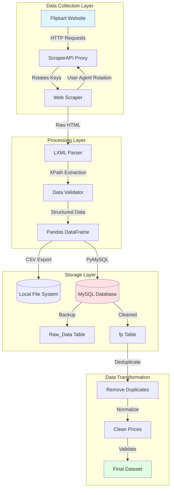
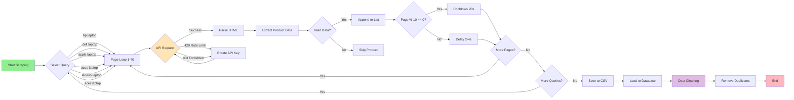
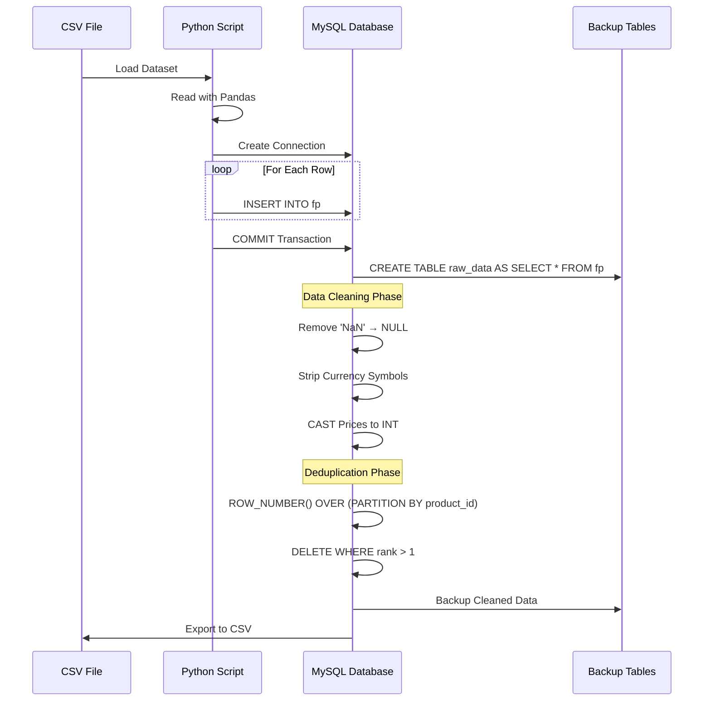
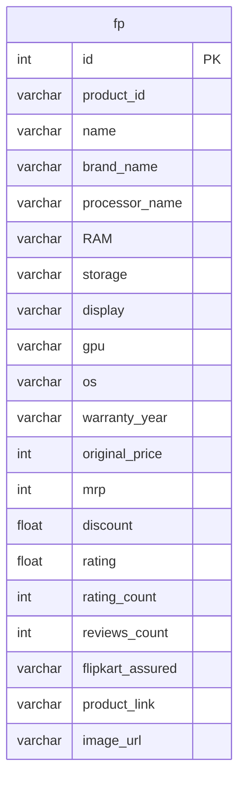
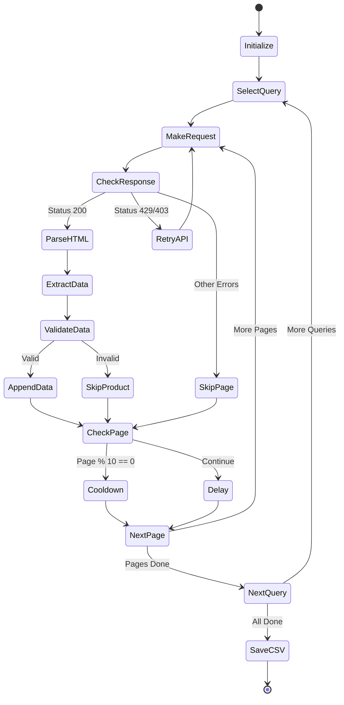

# 🛒 Flipkart Laptop Analysis

<div align="center">


**A comprehensive web scraping and data analysis project for extracting, processing, and analyzing laptop data from Flipkart**

[Features](#-features) • [Architecture](#-architecture) • [Installation](#-installation) • [Usage](#-usage) • [Database Schema](#-database-schema)

</div>

---

## 📋 Table of Contents

- [Overview](#-overview)
- [Features](#-features)
- [Architecture](#-architecture)
- [Tech Stack](#-tech-stack)
- [Project Structure](#-project-structure)
- [Installation](#-installation)
- [Usage](#-usage)
- [Database Schema](#-database-schema)
- [Data Flow](#-data-flow)
- [Key Components](#-key-components)
- [Challenges & Solutions](#-challenges--solutions)
- [Future Enhancements](#-future-enhancements)
- [Contributing](#-contributing)
- [License](#-license)

---

## 🎯 Overview

This project demonstrates end-to-end data engineering capabilities by scraping laptop product data from Flipkart, processing it through a robust ETL pipeline, and storing it in a relational database for analysis. The system handles rate limiting, data cleaning, deduplication, and provides a structured dataset ready for analytical insights.

### Key Highlights

- 🎯 **Multi-Query Scraping**: Targets multiple laptop brands (HP, Dell, Apple, ASUS, Lenovo, Acer)
- 🔄 **API Rotation**: Implements ScraperAPI with multiple key rotation for reliability
- 🧹 **Data Cleaning**: Comprehensive data validation and normalization
- 🗄️ **Database Integration**: Full MySQL/MariaDB integration with optimized schema
- 📊 **Scalable Design**: Handles 1000+ products with duplicate detection

---

## ✨ Features

### Web Scraping Engine
- ✅ **Dynamic XPath Parsing** - Robust extraction of product details
- ✅ **Rate Limit Handling** - Smart delays and cooldown periods
- ✅ **Multiple User Agents** - Rotation to avoid detection
- ✅ **Error Recovery** - Automatic retry mechanisms
- ✅ **API Key Rotation** - Seamless failover between ScraperAPI keys

### Data Processing
- ✅ **Duplicate Detection** - ROW_NUMBER() based deduplication
- ✅ **Price Normalization** - Currency symbol and comma removal
- ✅ **Null Handling** - Intelligent replacement of 'NaN' values
- ✅ **Data Validation** - Type checking and constraint enforcement

### Database Management
- ✅ **Optimized Schema** - Indexed columns for fast queries
- ✅ **Backup Strategy** - Raw data preservation before transformations
- ✅ **SQL Automation** - Bulk insert operations via Python
- ✅ **Data Export** - CSV export functionality

---

## 🏗️ Architecture

### System Architecture



### Data Flow Pipeline



### Database ETL Pipeline



---

## 🛠️ Tech Stack

### Languages & Frameworks


### Libraries & Tools

| Category | Technology | Purpose |
|----------|-----------|---------|
| **Web Scraping** | `requests` | HTTP requests to Flipkart |
| | `lxml` | HTML parsing and XPath queries |
| | `ScraperAPI` | Proxy rotation and anti-bot bypass |
| **Data Processing** | `pandas` | Data manipulation and CSV handling |
| | `regex` | Pattern matching for data extraction |
| **Database** | `pymysql` | MySQL database connectivity |
| | `MariaDB` | Relational database management |
| **Utilities** | `time` | Rate limiting and delays |
| | `random` | User agent rotation |

---

## 📁 Project Structure

```
surajakhuli-flipkart_laptop_analysis/
│
├── 📜 final_scrapper.py          # Main production scraper
├── 📜 scrape.py                   # Initial scraper prototype
├── 📜 dbConn.py                   # Database connection & data loader
├── 📜 xpath_tester.py             # XPath query testing utility
├── 📄 DB_Code.txt                 # SQL commands and database setup
└── 📂 output/
    ├── flipkart_laptops_cleaned.csv
    └── removed_duplicates_file.csv
```

### File Descriptions

- **`final_scrapper.py`**: Production-ready scraper with multi-query support, API key rotation, and comprehensive error handling
- **`scrape.py`**: Initial prototype for testing XPath selectors and basic scraping logic
- **`dbConn.py`**: Handles bulk data insertion from Excel/CSV to MySQL database
- **`xpath_tester.py`**: Standalone utility for testing and debugging XPath expressions
- **`DB_Code.txt`**: Complete SQL documentation including table creation, cleaning operations, and backup strategies

---

## 🚀 Installation

### Prerequisites

- Python 3.8 or higher
- MySQL/MariaDB Server
- ScraperAPI Account (for API keys)

### Step 1: Clone Repository

```bash
git clone https://github.com/surajakhuli/flipkart-laptop-analysis.git
cd flipkart-laptop-analysis
```

### Step 2: Install Dependencies

```bash
pip install -r requirements.txt
```

**Required Libraries:**
```txt
requests==2.31.0
lxml==4.9.3
pandas==2.1.0
pymysql==1.1.0
openpyxl==3.1.2
```

### Step 3: Configure Database

```sql
-- Create database
CREATE DATABASE project;

-- Create table
CREATE TABLE flipkart_products (
    product_id VARCHAR(20),
    name VARCHAR(255),
    brand_name VARCHAR(20),
    processor_name VARCHAR(120),
    RAM VARCHAR(120),
    storage VARCHAR(20),
    display VARCHAR(100),
    gpu VARCHAR(100),
    os VARCHAR(150),
    warranty_year VARCHAR(100),
    original_price VARCHAR(20),
    mrp VARCHAR(20),
    discount FLOAT,
    rating FLOAT,
    rating_count INT,
    reviews_count INT,
    flipkart_assured VARCHAR(10),
    product_link VARCHAR(500),
    image_url VARCHAR(500),
    PRIMARY KEY(product_id)
);
```

### Step 4: Configure API Keys

Update `final_scrapper.py` with your ScraperAPI keys:

```python
api_keys = [
    "YOUR_API_KEY_1",
    "YOUR_API_KEY_2",
    "YOUR_API_KEY_3"
]
```

---

## 💻 Usage

### Running the Scraper

```bash
python final_scrapper.py
```

**Expected Output:**
```
🔍 Scraping query: hp laptop
Scraping page 1 of hp laptop...
Scraping page 2 of hp laptop...
...
😴 Cooling down after 10 pages...
...
✅ Scraping complete. Saved 1267 records to flipkart_laptops_cleaned.csv
```

### Loading Data to Database

```bash
python dbConn.py
```

**Expected Output:**
```
✅ Loaded 1267 rows from the dataset.
✅ Connected to database.
✅ Done! Inserted 1267 rows into 'flipkart_products'.
🔒 Connection closed.
```

### Testing XPath Selectors

```bash
python xpath_tester.py
```

---

## 🗃️ Database Schema

### Main Table: `fp` (flipkart_products)



### Backup Tables

- **`raw_data`**: Original scraped data before any transformations
- **`raw_data_removed_duplicates`**: Backup after deduplication process

### Key Indexes

```sql
-- Add indexes for performance
CREATE INDEX idx_brand ON fp(brand_name);
CREATE INDEX idx_price ON fp(original_price);
CREATE INDEX idx_rating ON fp(rating);
```

---

## 🔄 Data Flow

### Phase 1: Data Collection



### Phase 2: Data Cleaning

1. **Null Handling**: Replace 'NaN' strings with NULL
2. **Price Normalization**: Remove ₹ symbols and commas
3. **Type Conversion**: Cast string prices to integers
4. **Duplicate Removal**: ROW_NUMBER() window function
5. **Validation**: Ensure data integrity constraints

---

## 🔑 Key Components

### 1. ScraperAPI Integration

```python
def get_scraperapi_response(url, headers, api_keys):
    for key in api_keys:
        scraper_url = f"https://api.scraperapi.com/?api_key={key}&url={url}"
        try:
            response = requests.get(scraper_url, headers=headers, timeout=15)
            if response.status_code == 200:
                return response
            elif response.status_code == 429:
                continue  # Try next key
        except Exception as e:
            continue
    return None
```

### 2. XPath Data Extraction

```python
# Product name
name = block.xpath('.//div[@class="KzDlHZ"]/text()')

# Rating
rating = block.xpath('string(.//div[@class="XQDdHH"])').strip()

# Specifications
specs = block.xpath('.//ul[@class="G4BRas"]/li/text()')
```

### 3. Duplicate Removal SQL

```sql
DELETE FROM fp WHERE id IN (
    SELECT id FROM (
        SELECT id, 
               ROW_NUMBER() OVER (PARTITION BY product_id ORDER BY id) AS ranknum 
        FROM fp
    ) AS fulldata
    WHERE ranknum > 1
);
```

---

## 🚧 Challenges & Solutions

| Challenge | Solution |
|-----------|----------|
| **Rate Limiting** | Implemented ScraperAPI with multiple key rotation |
| **Dynamic Content** | Used robust XPath with fallback selectors |
| **Data Inconsistency** | Created comprehensive validation layer |
| **Duplicate Records** | Window function based deduplication |
| **Price Formatting** | Regex-based cleaning and type casting |
| **File Locking** | Automatic filename increment on save |

---

## 🎯 Future Enhancements

- [ ] 📊 Power BI/Tableau dashboard integration
- [ ] 🤖 Machine learning price prediction model
- [ ] 📧 Email alerts for price drops
- [ ] 🔄 Automated daily scraping with cron jobs
- [ ] 🌐 REST API for data access
- [ ] 📱 Mobile app for product tracking
- [ ] 🧪 Unit tests and CI/CD pipeline
- [ ] 🐳 Docker containerization

---

## 📊 Sample Analytics Queries

### Top Rated Laptops
```sql
SELECT name, brand_name, rating, original_price
FROM fp
WHERE rating >= 4.5
ORDER BY rating DESC, rating_count DESC
LIMIT 10;
```

### Price Range Distribution
```sql
SELECT 
    CASE 
        WHEN original_price < 30000 THEN 'Budget'
        WHEN original_price BETWEEN 30000 AND 60000 THEN 'Mid-Range'
        ELSE 'Premium'
    END AS price_category,
    COUNT(*) AS count,
    AVG(rating) AS avg_rating
FROM fp
GROUP BY price_category;
```

### Brand Comparison
```sql
SELECT 
    brand_name,
    COUNT(*) AS products,
    AVG(original_price) AS avg_price,
    AVG(discount) AS avg_discount,
    AVG(rating) AS avg_rating
FROM fp
GROUP BY brand_name
ORDER BY products DESC;
```

---

## 🤝 Contributing

Contributions are welcome! Please follow these steps:

1. Fork the repository
2. Create a feature branch (`git checkout -b feature/AmazingFeature`)
3. Commit your changes (`git commit -m 'Add some AmazingFeature'`)
4. Push to the branch (`git push origin feature/AmazingFeature`)
5. Open a Pull Request

---

## 📝 License

This project is licensed under the MIT License - see the [LICENSE](LICENSE) file for details.

---

## 👤 Author

**Suraj Akhuli**

- GitHub: [@Suraj Akhuli](https://github.com/SurajAkhuli)
- LinkedIn: [Suraj Akhuli](https://www.linkedin.com/in/suraj-akhuli-3b6a5a264)

---

## 🙏 Acknowledgments

- ScraperAPI for reliable proxy services
- Flipkart for providing accessible product data
- The open-source community for amazing libraries

---

<div align="center">

**⭐ Star this repository if you found it helpful!**

Made with ❤️ by Suraj Akhuli

</div>
